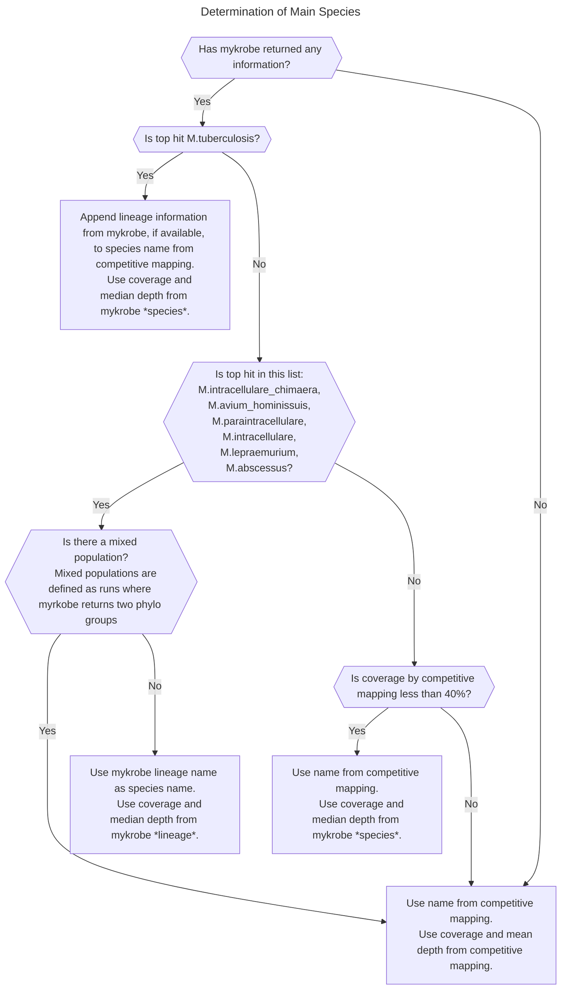

```mermaid
---
title: Determination of Main Species
---
graph TD
    MYKROBE_RETURN{{Has mykrobe returned any information?}}

    ALL_CM[Use name from competitive mapping.
    Use coverage and mean depth from competitive mapping.]

    TOPHIT_TB{{Is top hit <it>M.tuberculosis</it>?}}

    PROCESS_TB[Append lineage information from mykrobe, if available, to species name from competitive mapping.
    Use coverage and median depth from mykrobe *species*.]

    TOPHIT_SPECIAL_NTM{{Is top hit in this list:
    M.intracellulare_chimaera,
    M.avium_hominissuis,
    M.paraintracellulare,
    M.intracellulare,
    M.lepraemurium,
    M.abscessus?}}

    MIXED{{Is there a mixed population?
    Mixed populations are defined as runs where myrkobe returns two phylo groups}}

    PROCESS_SPECIAL_NTM_UNMIXED[Use mykrobe lineage name as species name.
    Use coverage and median depth from mykrobe *lineage*.]

    LOW_COV{{Is coverage by competitive mapping less than 40%?}}

    PROCESS_LOW_COV[Use name from competitive mapping.
    Use coverage and median depth from mykrobe *species*.]

    MYKROBE_RETURN--Yes-->TOPHIT_TB
    MYKROBE_RETURN--Noo-->ALL_CM

    TOPHIT_TB--Yes-->PROCESS_TB
    TOPHIT_TB--Noo-->TOPHIT_SPECIAL_NTM

    TOPHIT_SPECIAL_NTM--Yes-->MIXED
    MIXED--Yes-->ALL_CM
    MIXED--Noo-->PROCESS_SPECIAL_NTM_UNMIXED
    TOPHIT_SPECIAL_NTM--Noo-->LOW_COV

    LOW_COV--Yes-->PROCESS_LOW_COV
    LOW_COV--Noo-->ALL_CM

```