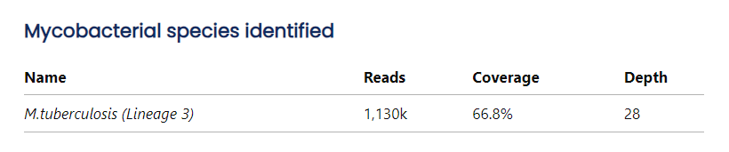
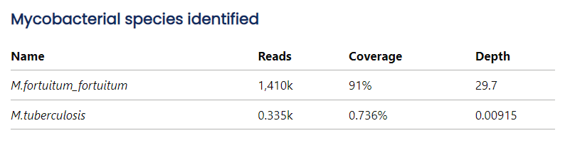
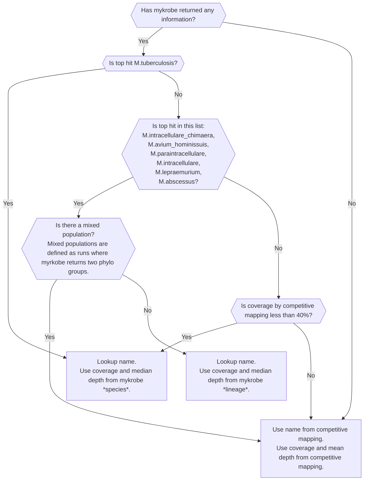

# Determination of mycobacterial species, subspecies and lineage by the Summary Pipeline 

Part of the Summary Pipeline works on genetic information that has already been assigned to the genus mycobacteriaceae. If the species is Mycobacterium tuberculosis then a lineage may also be assigned. Other species may be assigned a subspecies. This information appears in the "Mycobacterial species identified" section of the user interface:

_Mycobacterium tuberculosis_ (Lineage 3)

_Mycobacterium fortuitum_ subspecies _fortuitum_

Two sources of information are used to inform the speciation decision [Competitive Mapping](https://github.com/GlobalPathogenAnalysisService/competitivemapping_pipeline) and [mykrobe](https://github.com/GlobalPathogenAnalysisService/lineagecalling_pipeline). These each output a JSON file which is analysed by the code in this repository to determine species information.  

Competitive mapping outputs a list of species, which can be ordered by "coverage" (the proportion of a reference genome to which reads in the sample "map" i.e. are very similar to) to give a "top hit" species. However, competitive mapping does not provide information on lineage or subspecies. This information can in some cases be obtained from mykrobe, which reports subspecies, phylogenic group and lineage. 

Number of reads mapped (Reads) is always sourced from competitive mapping.

The way in which the Summary Pipeline assigns species, subspecies and lineage can be summarised by a graph. 

_Determination of what species information to report_

The name returned is determined by using the species name from Competitive Mapping and the lineage name from mykrobe (if available). Where no combination of Competitive Mapping and lineage name can be found in the reference table ([example reference table](test_data/reference/name_mapping.csv)), the Competitive Mapping name is used.

## Additional steps for mixed populations

