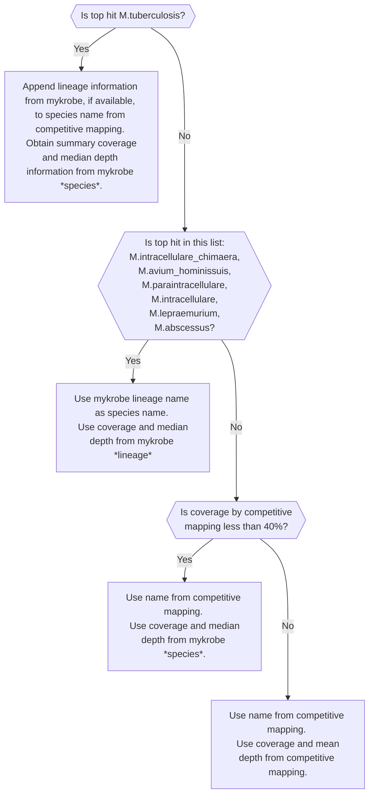

```mermaid
graph TD
    TOPHIT_TB{{Is top hit <it>M.tuberculosis</it>?}}

    PROCESS_TB[Append lineage information from mykrobe, if available, to species name from competitive mapping. <br> Obtain summary coverage and median depth information from mykrobe *species*.]

    TOPHIT_NTM{{Is top hit in this list:<br/> M.intracellulare_chimaera,<br/> M.avium_hominissuis,<br/> M.paraintracellulare,<br/> M.intracellulare,<br/> M.lepraemurium,<br/> M.abscessus?}}

    PROCESS_NTM[Use mykrobe lineage name as species name. <br/> Use coverage and median depth from mykrobe *lineage*]

    LOW_COV{{Is coverage by competitive<br/> mapping less than 40%?}}

    PROCESS_LOW_COV[Use name from competitive mapping. <br/> Use coverage and median depth from mykrobe *species*.]

    PROCESS_ELSE[Use name from competitive mapping. <br/> Use coverage and mean depth from competitive mapping.]

    TOPHIT_TB--Yes-->PROCESS_TB
    TOPHIT_TB--Noo-->TOPHIT_NTM
    TOPHIT_NTM--Yes-->PROCESS_NTM
    TOPHIT_NTM--Noo-->LOW_COV
    LOW_COV--Yes-->PROCESS_LOW_COV
    LOW_COV--Noo-->PROCESS_ELSE

```